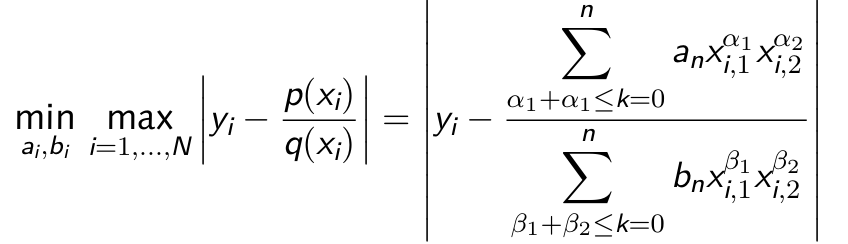

# RClass - Classification by Rational Approximation


## Project Overview
This project is a group effort aimed at developing a unique classification model based on rational functions. Unlike traditional classifiers (such as neural networks or logistic regression), our approach explores the use of rational function approximations for classifying images. For this project, we are using the MNIST dataset of handwritten digits as a test case to evaluate the effectiveness of this novel classifier.

## Project Goals
- Implement a classification model that uses rational functions for image classification.
- Train the model on the MNIST dataset, a popular dataset consisting of 28x28 grayscale images of handwritten digits (0-9).
- Analyze the performance of rational function-based classification, including accuracy and computational efficiency.
- Document findings, challenges, and insights for potential future applications and improvements.

## Gurobi Licensing
This project utilizes the Gurobi Optimizer, which is a proprietary software and requires a valid license for use. The code provided in this repository was developed using a student license obtained from Gurobi. If you wish to run the code, you will need to obtain your own Gurobi license from the Gurobi website.

---
## Attribution & Credits

### Academic Project Background
This rational function classifier was developed as part of a special project (3rd semester) at the **Chair of Applied Mathematics, Faculty of Civil Engineering, Bauhaus-Universität Weimar** under the supervision of:
- **Prof. Dr. rer. nat. Björn Rüffer** (Project Supervisor)  
- **Dr. rer. nat. habil. Michael Schönlein** (Project Examiner)

### Team Collaboration
This work was completed as a **collaborative team project** with three members:
- **Omar Ghariani** (M.Sc. Digital Engineering)  
- **Helen Dawit Weldemichael** (M.Sc. Digital Engineering)  
- **Ajay Patil** (M.Sc. Digital Engineering) — *Current Kaggle Model Publisher*

**Team Approach:** Each member independently developed the rational function classifier using different frameworks (SageMath, SciPy, Gurobi), and the best-performing implementation was selected.

### Faculty Contribution
- **Theoretical framework guidance:** Provided by faculty supervision
- **Multi-indices generation algorithm:** Provided by Prof. Dr. Björn Rüffer

### Open-Source Implementation
This Kaggle model represents the **open-source Python implementation** by Ajay Patil. While the mathematical approach was developed collaboratively.

### Academic Reference
*Project Report:* “RClass—Classification by Rational Approximation” (March 2025), Bauhaus-Universität Weimar

### Usage & Citation

If you use this model or methodology in your work, please cite:
```plaintext
RClass—Classification by Rational Approximation (2025)
Developed at Bauhaus-Universität Weimar under supervision of Prof. Dr. Björn Rüffer
Original team: Omar Ghariani, Helen Dawit Weldemichael, Ajay Patil
Kaggle implementation by: [Ajay Patil](https://www.kaggle.com/ajaypatil047)
```
